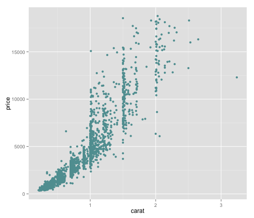
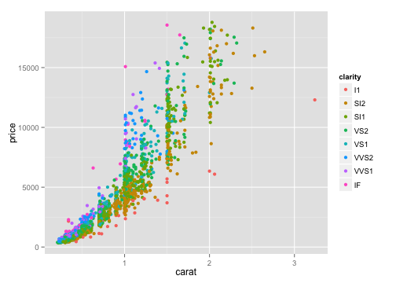

--- 
title       : Trying Slidify for the first time
subtitle    : Changing the style
author      : Me
job         : 
framework   : io2012        # {io2012, html5slides, shower, dzslides, ...}
highlighter : highlight.js  # {highlight.js, prettify, highlight}
hitheme     : default      # 
widgets     : [mathjax]            # {mathjax, quiz, bootstrap}
ext_widgets : {rCharts: [libraries/nvd3]}
mode        : selfcontained # {standalone, draft}
knit        : slidify::knit2slides
--- 

## Equations

$$\frac{1}{n}\sum_{i=1}^n y_i$$

--- 

## Code


```r
x<-(1:10)
sum(x)
```

```
## [1] 55
```


--- 
## Slide 3

Make a list:  
* item 1  
* item 2  

Add a [link](http://slidify.org/start.html)


---

## Interactive Chart


<div id = 'chart1' class = 'rChart nvd3'></div>
<script type='text/javascript'>
 $(document).ready(function(){
      drawchart1()
    });
    function drawchart1(){  
      var opts = {
 "dom": "chart1",
"width":    800,
"height":    400,
"x": "Hair",
"y": "Freq",
"group": "Eye",
"type": "multiBarChart",
"id": "chart1" 
},
        data = [
 {
 "Hair": "Black",
"Eye": "Brown",
"Sex": "Male",
"Freq":             32 
},
{
 "Hair": "Brown",
"Eye": "Brown",
"Sex": "Male",
"Freq":             53 
},
{
 "Hair": "Red",
"Eye": "Brown",
"Sex": "Male",
"Freq":             10 
},
{
 "Hair": "Blond",
"Eye": "Brown",
"Sex": "Male",
"Freq":              3 
},
{
 "Hair": "Black",
"Eye": "Blue",
"Sex": "Male",
"Freq":             11 
},
{
 "Hair": "Brown",
"Eye": "Blue",
"Sex": "Male",
"Freq":             50 
},
{
 "Hair": "Red",
"Eye": "Blue",
"Sex": "Male",
"Freq":             10 
},
{
 "Hair": "Blond",
"Eye": "Blue",
"Sex": "Male",
"Freq":             30 
},
{
 "Hair": "Black",
"Eye": "Hazel",
"Sex": "Male",
"Freq":             10 
},
{
 "Hair": "Brown",
"Eye": "Hazel",
"Sex": "Male",
"Freq":             25 
},
{
 "Hair": "Red",
"Eye": "Hazel",
"Sex": "Male",
"Freq":              7 
},
{
 "Hair": "Blond",
"Eye": "Hazel",
"Sex": "Male",
"Freq":              5 
},
{
 "Hair": "Black",
"Eye": "Green",
"Sex": "Male",
"Freq":              3 
},
{
 "Hair": "Brown",
"Eye": "Green",
"Sex": "Male",
"Freq":             15 
},
{
 "Hair": "Red",
"Eye": "Green",
"Sex": "Male",
"Freq":              7 
},
{
 "Hair": "Blond",
"Eye": "Green",
"Sex": "Male",
"Freq":              8 
} 
]
  
      if(!(opts.type==="pieChart" || opts.type==="sparklinePlus" || opts.type==="bulletChart")) {
        var data = d3.nest()
          .key(function(d){
            //return opts.group === undefined ? 'main' : d[opts.group]
            //instead of main would think a better default is opts.x
            return opts.group === undefined ? opts.y : d[opts.group];
          })
          .entries(data);
      }
      
      if (opts.disabled != undefined){
        data.map(function(d, i){
          d.disabled = opts.disabled[i]
        })
      }
      
      nv.addGraph(function() {
        var chart = nv.models[opts.type]()
          .width(opts.width)
          .height(opts.height)
          
        if (opts.type != "bulletChart"){
          chart
            .x(function(d) { return d[opts.x] })
            .y(function(d) { return d[opts.y] })
        }
          
         
        
          
        

        
        
        
      
       d3.select("#" + opts.id)
        .append('svg')
        .datum(data)
        .transition().duration(500)
        .call(chart);

       nv.utils.windowResize(chart.update);
       return chart;
      });
    };
</script>

--- &twocol

## Two Column Layout   

*** =left
 


*** =right
 

*** =fullwidth
Going back to full width

