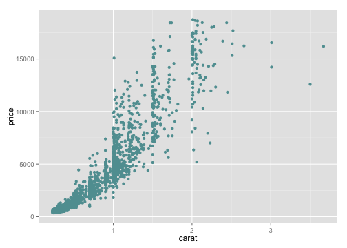
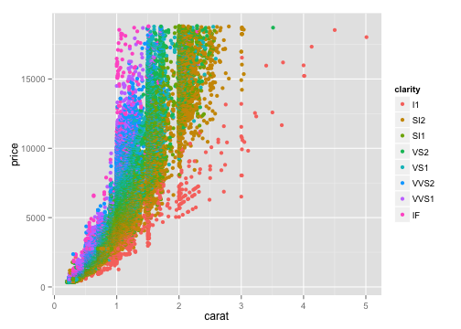

--- 
title       : Trying Slidify for the first time
subtitle    : Changing the style
author      : Me
job         : 
framework   : io2012        # {io2012, html5slides, shower, dzslides, ...}
highlighter : highlight.js  # {highlight.js, prettify, highlight}
hitheme     : default      # 
widgets     : [mathjax, shiny, interactive, quiz]            # {mathjax, quiz, bootstrap}
ext_widgets : {rCharts: [libraries/nvd3]}
mode        : selfcontained # {standalone, draft}
knit        : slidify::knit2slides
--- 

## Equations

First, add "mathjax" to the widgets in the YAML. Then use $\LaTeX$ to write the equations.  
Exemples:    

1. The exponential distribution is defined by the probability density function $f(x,\lambda)=\lambda e^{-\lambda x}$ for $x\geq 0$ and with $\lambda$ the rate parameter.  

2. $$\frac{1}{n}\sum_{i=1}^n y_i$$  

3. $$SE=\frac{\sigma}{\sqrt{n}}=\frac{1}{\lambda\sqrt{n}}$$  

--- 

## Code

The way code is highlighted is controlled by the hitheme value in the YAML. This effect is the "default" one. "tomorrow" creates white rectangles.

```r
x<-(1:10)
sum(x)
```

```
## [1] 55
```


--- &vcenter

## Center

This is a test. I haven't managed to center the content and keep the horizontal grey line. If a do that, the content is centered horizontally only. 

---

## Likn and list

Add a [link](http://slidify.org/start.html)  

To reveal incrementally:  

> * item 1  
> * item 2     
  

--- &twocol

## Two Column Layout 

Blabla

*** =left
 


*** =right
 

*** =fullwidth
Can write something here.

---
## Interactive chart 

Total emissions of air pollutants for the 5 countries with the highest levels of emissions in 2013 emissions (unit: 1000 tonnes).  


<div id = 'topem2013' class = 'rChart nvd3'></div>
<script type='text/javascript'>
 $(document).ready(function(){
      drawtopem2013()
    });
    function drawtopem2013(){  
      var opts = {
 "dom": "topem2013",
"width":    800,
"height":    400,
"x": "locationvar",
"y": "emissions",
"group": "airpol",
"type": "multiBarChart",
"id": "topem2013" 
},
        data = [
 {
 "X": 1,
"unit": true,
"airpol": "NH3",
"sect": "TOT_NAT",
"locationvar": "DE",
"variable": "X2013",
"value": 670849,
"emissions":        670.849 
},
{
 "X": 2,
"unit": true,
"airpol": "NH3",
"sect": "TOT_NAT",
"locationvar": "FR",
"variable": "X2013",
"value": 718133,
"emissions":        718.133 
},
{
 "X": 3,
"unit": true,
"airpol": "NH3",
"sect": "TOT_NAT",
"locationvar": "IT",
"variable": "X2013",
"value": 402230,
"emissions":         402.23 
},
{
 "X": 4,
"unit": true,
"airpol": "NH3",
"sect": "TOT_NAT",
"locationvar": "PL",
"variable": "X2013",
"value": 263402,
"emissions":        263.402 
},
{
 "X": 5,
"unit": true,
"airpol": "NH3",
"sect": "TOT_NAT",
"locationvar": "GB",
"variable": "X2013",
"value": 271309,
"emissions":        271.309 
},
{
 "X": 6,
"unit": true,
"airpol": "NMVOC",
"sect": "TOT_NAT",
"locationvar": "DE",
"variable": "X2013",
"value": 1138241,
"emissions":       1138.241 
},
{
 "X": 7,
"unit": true,
"airpol": "NMVOC",
"sect": "TOT_NAT",
"locationvar": "FR",
"variable": "X2013",
"value": 758380,
"emissions":         758.38 
},
{
 "X": 8,
"unit": true,
"airpol": "NMVOC",
"sect": "TOT_NAT",
"locationvar": "IT",
"variable": "X2013",
"value": 905539,
"emissions":        905.539 
},
{
 "X": 9,
"unit": true,
"airpol": "NMVOC",
"sect": "TOT_NAT",
"locationvar": "PL",
"variable": "X2013",
"value": 635776,
"emissions":        635.776 
},
{
 "X": 10,
"unit": true,
"airpol": "NMVOC",
"sect": "TOT_NAT",
"locationvar": "GB",
"variable": "X2013",
"value": 802997,
"emissions":        802.997 
},
{
 "X": 11,
"unit": true,
"airpol": "NOX",
"sect": "TOT_NAT",
"locationvar": "DE",
"variable": "X2013",
"value": 1269182,
"emissions":       1269.182 
},
{
 "X": 12,
"unit": true,
"airpol": "NOX",
"sect": "TOT_NAT",
"locationvar": "FR",
"variable": "X2013",
"value": 989521,
"emissions":        989.521 
},
{
 "X": 13,
"unit": true,
"airpol": "NOX",
"sect": "TOT_NAT",
"locationvar": "IT",
"variable": "X2013",
"value": 820574,
"emissions":        820.574 
},
{
 "X": 14,
"unit": true,
"airpol": "NOX",
"sect": "TOT_NAT",
"locationvar": "PL",
"variable": "X2013",
"value": 798233,
"emissions":        798.233 
},
{
 "X": 15,
"unit": true,
"airpol": "NOX",
"sect": "TOT_NAT",
"locationvar": "GB",
"variable": "X2013",
"value": 1019674,
"emissions":       1019.674 
},
{
 "X": 16,
"unit": true,
"airpol": "PM10",
"sect": "TOT_NAT",
"locationvar": "DE",
"variable": "X2013",
"value": 228339,
"emissions":        228.339 
},
{
 "X": 17,
"unit": true,
"airpol": "PM10",
"sect": "TOT_NAT",
"locationvar": "FR",
"variable": "X2013",
"value": 271758,
"emissions":        271.758 
},
{
 "X": 18,
"unit": true,
"airpol": "PM10",
"sect": "TOT_NAT",
"locationvar": "IT",
"variable": "X2013",
"value": 193718,
"emissions":        193.718 
},
{
 "X": 19,
"unit": true,
"airpol": "PM10",
"sect": "TOT_NAT",
"locationvar": "PL",
"variable": "X2013",
"value": 246201,
"emissions":        246.201 
},
{
 "X": 20,
"unit": true,
"airpol": "PM10",
"sect": "TOT_NAT",
"locationvar": "GB",
"variable": "X2013",
"value": 123478,
"emissions":        123.478 
},
{
 "X": 21,
"unit": true,
"airpol": "PM2_5",
"sect": "TOT_NAT",
"locationvar": "DE",
"variable": "X2013",
"value": 112731,
"emissions":        112.731 
},
{
 "X": 22,
"unit": true,
"airpol": "PM2_5",
"sect": "TOT_NAT",
"locationvar": "FR",
"variable": "X2013",
"value": 181346,
"emissions":        181.346 
},
{
 "X": 23,
"unit": true,
"airpol": "PM2_5",
"sect": "TOT_NAT",
"locationvar": "IT",
"variable": "X2013",
"value": 168438,
"emissions":        168.438 
},
{
 "X": 24,
"unit": true,
"airpol": "PM2_5",
"sect": "TOT_NAT",
"locationvar": "PL",
"variable": "X2013",
"value": 144510,
"emissions":         144.51 
},
{
 "X": 25,
"unit": true,
"airpol": "PM2_5",
"sect": "TOT_NAT",
"locationvar": "GB",
"variable": "X2013",
"value": 81516,
"emissions":         81.516 
},
{
 "X": 26,
"unit": true,
"airpol": "SOX",
"sect": "TOT_NAT",
"locationvar": "DE",
"variable": "X2013",
"value": 416214,
"emissions":        416.214 
},
{
 "X": 27,
"unit": true,
"airpol": "SOX",
"sect": "TOT_NAT",
"locationvar": "FR",
"variable": "X2013",
"value": 218785,
"emissions":        218.785 
},
{
 "X": 28,
"unit": true,
"airpol": "SOX",
"sect": "TOT_NAT",
"locationvar": "IT",
"variable": "X2013",
"value": 145054,
"emissions":        145.054 
},
{
 "X": 29,
"unit": true,
"airpol": "SOX",
"sect": "TOT_NAT",
"locationvar": "PL",
"variable": "X2013",
"value": 846845,
"emissions":        846.845 
},
{
 "X": 30,
"unit": true,
"airpol": "SOX",
"sect": "TOT_NAT",
"locationvar": "GB",
"variable": "X2013",
"value": 393158,
"emissions":        393.158 
} 
]
  
      if(!(opts.type==="pieChart" || opts.type==="sparklinePlus" || opts.type==="bulletChart")) {
        var data = d3.nest()
          .key(function(d){
            //return opts.group === undefined ? 'main' : d[opts.group]
            //instead of main would think a better default is opts.x
            return opts.group === undefined ? opts.y : d[opts.group];
          })
          .entries(data);
      }
      
      if (opts.disabled != undefined){
        data.map(function(d, i){
          d.disabled = opts.disabled[i]
        })
      }
      
      nv.addGraph(function() {
        var chart = nv.models[opts.type]()
          .width(opts.width)
          .height(opts.height)
          
        if (opts.type != "bulletChart"){
          chart
            .x(function(d) { return d[opts.x] })
            .y(function(d) { return d[opts.y] })
        }
          
         
        
          
        

        
        
        
      
       d3.select("#" + opts.id)
        .append('svg')
        .datum(data)
        .transition().duration(500)
        .call(chart);

       nv.utils.windowResize(chart.update);
       return chart;
      });
    };
</script>


--- &interactive 

## Interactive map

Emissions of NOx (tonnes) in Europe in 2013
<!-- GeoChart generated in R 3.1.3 by googleVis 0.5.8 package -->
<!-- Fri Feb 12 15:09:35 2016 -->


<!-- jsHeader -->
<script type="text/javascript">
 
// jsData 
function gvisDataGeoChartIDf7294f789d () {
var data = new google.visualization.DataTable();
var datajson =
[
 [
 "AT",
162317 
],
[
 "BE",
207680 
],
[
 "BG",
122573 
],
[
 "CH",
72304 
],
[
 "CY",
16164 
],
[
 "CZ",
181094 
],
[
 "DE",
1269182 
],
[
 "DK",
123865 
],
[
 "EE",
29721 
],
[
 "GR",
238621 
],
[
 "ES",
812152 
],
[
 "FI",
144877 
],
[
 "FR",
989521 
],
[
 "HR",
55749 
],
[
 "HU",
120567 
],
[
 "IE",
79064 
],
[
 "IS",
20775 
],
[
 "IT",
820574 
],
[
 "LI",
704 
],
[
 "LT",
46166 
],
[
 "LU",
31434 
],
[
 "LV",
34044 
],
[
 "MT",
4872 
],
[
 "NL",
239619 
],
[
 "NO",
154437 
],
[
 "PL",
798233 
],
[
 "PT",
161476 
],
[
 "RO",
218823 
],
[
 "SE",
125915 
],
[
 "SI",
42893 
],
[
 "SK",
79582 
],
[
 "GB",
1019674 
] 
];
data.addColumn('string','Country');
data.addColumn('number','Emissions');
data.addRows(datajson);
return(data);
}


// jsData 
function gvisDataTableIDf72077a09b () {
var data = new google.visualization.DataTable();
var datajson =
[
 [
 "AT",
162317 
],
[
 "BE",
207680 
],
[
 "BG",
122573 
],
[
 "CH",
72304 
],
[
 "CY",
16164 
],
[
 "CZ",
181094 
],
[
 "DE",
1269182 
],
[
 "DK",
123865 
],
[
 "EE",
29721 
],
[
 "GR",
238621 
],
[
 "ES",
812152 
],
[
 "FI",
144877 
],
[
 "FR",
989521 
],
[
 "HR",
55749 
],
[
 "HU",
120567 
],
[
 "IE",
79064 
],
[
 "IS",
20775 
],
[
 "IT",
820574 
],
[
 "LI",
704 
],
[
 "LT",
46166 
],
[
 "LU",
31434 
],
[
 "LV",
34044 
],
[
 "MT",
4872 
],
[
 "NL",
239619 
],
[
 "NO",
154437 
],
[
 "PL",
798233 
],
[
 "PT",
161476 
],
[
 "RO",
218823 
],
[
 "SE",
125915 
],
[
 "SI",
42893 
],
[
 "SK",
79582 
],
[
 "GB",
1019674 
] 
];
data.addColumn('string','Country');
data.addColumn('number','Emissions');
data.addRows(datajson);
return(data);
}
 
// jsDrawChart
function drawChartGeoChartIDf7294f789d() {
var data = gvisDataGeoChartIDf7294f789d();
var options = {};
options["width"] =    700;
options["height"] =    400;
options["region"] = "150";
options["displayMode"] = "regions";
options["resolution"] = "countries";
options["colorAxis"] = {colors:['#bbd2cb','#0C6D51']};

    var chart = new google.visualization.GeoChart(
    document.getElementById('GeoChartIDf7294f789d')
    );
    chart.draw(data,options);
    

}
  


// jsDrawChart
function drawChartTableIDf72077a09b() {
var data = gvisDataTableIDf72077a09b();
var options = {};
options["allowHtml"] = true;
options["height"] =    400;

    var chart = new google.visualization.Table(
    document.getElementById('TableIDf72077a09b')
    );
    chart.draw(data,options);
    

}
  
 
// jsDisplayChart
(function() {
var pkgs = window.__gvisPackages = window.__gvisPackages || [];
var callbacks = window.__gvisCallbacks = window.__gvisCallbacks || [];
var chartid = "geochart";
  
// Manually see if chartid is in pkgs (not all browsers support Array.indexOf)
var i, newPackage = true;
for (i = 0; newPackage && i < pkgs.length; i++) {
if (pkgs[i] === chartid)
newPackage = false;
}
if (newPackage)
  pkgs.push(chartid);
  
// Add the drawChart function to the global list of callbacks
callbacks.push(drawChartGeoChartIDf7294f789d);
})();
function displayChartGeoChartIDf7294f789d() {
  var pkgs = window.__gvisPackages = window.__gvisPackages || [];
  var callbacks = window.__gvisCallbacks = window.__gvisCallbacks || [];
  window.clearTimeout(window.__gvisLoad);
  // The timeout is set to 100 because otherwise the container div we are
  // targeting might not be part of the document yet
  window.__gvisLoad = setTimeout(function() {
  var pkgCount = pkgs.length;
  google.load("visualization", "1", { packages:pkgs, callback: function() {
  if (pkgCount != pkgs.length) {
  // Race condition where another setTimeout call snuck in after us; if
  // that call added a package, we must not shift its callback
  return;
}
while (callbacks.length > 0)
callbacks.shift()();
} });
}, 100);
}


// jsDisplayChart
(function() {
var pkgs = window.__gvisPackages = window.__gvisPackages || [];
var callbacks = window.__gvisCallbacks = window.__gvisCallbacks || [];
var chartid = "table";
  
// Manually see if chartid is in pkgs (not all browsers support Array.indexOf)
var i, newPackage = true;
for (i = 0; newPackage && i < pkgs.length; i++) {
if (pkgs[i] === chartid)
newPackage = false;
}
if (newPackage)
  pkgs.push(chartid);
  
// Add the drawChart function to the global list of callbacks
callbacks.push(drawChartTableIDf72077a09b);
})();
function displayChartTableIDf72077a09b() {
  var pkgs = window.__gvisPackages = window.__gvisPackages || [];
  var callbacks = window.__gvisCallbacks = window.__gvisCallbacks || [];
  window.clearTimeout(window.__gvisLoad);
  // The timeout is set to 100 because otherwise the container div we are
  // targeting might not be part of the document yet
  window.__gvisLoad = setTimeout(function() {
  var pkgCount = pkgs.length;
  google.load("visualization", "1", { packages:pkgs, callback: function() {
  if (pkgCount != pkgs.length) {
  // Race condition where another setTimeout call snuck in after us; if
  // that call added a package, we must not shift its callback
  return;
}
while (callbacks.length > 0)
callbacks.shift()();
} });
}, 100);
}
 
// jsFooter
</script>
 
<!-- jsChart -->  
<script type="text/javascript" src="https://www.google.com/jsapi?callback=displayChartGeoChartIDf7294f789d"></script>


<!-- jsChart -->  
<script type="text/javascript" src="https://www.google.com/jsapi?callback=displayChartTableIDf72077a09b"></script>
 
<table border="0">
<tr>
<td>

<!-- divChart -->
  
<div id="GeoChartIDf7294f789d" 
  style="width: 700; height: 400;">
</div>

</td>
<td>

<!-- divChart -->
  
<div id="TableIDf72077a09b" 
  style="width: 500; height: 400;">
</div>

</td>
</tr>
</table>

--- &interactive

## Interactive console

Important note: use `runDeck()` and not `slidify()`to compile the slides.  
Emissions of SOX in France by the top four sectors over the years.  
<!-- MotionChart generated in R 3.1.3 by googleVis 0.5.8 package -->
<!-- Fri Feb 12 15:09:35 2016 -->


<!-- jsHeader -->
<script type="text/javascript">
 
// jsData 
function gvisDataMotionChartIDf76ca496b6 () {
var data = new google.visualization.DataTable();
var datajson =
[
 [
 "SE1_EPD",
new Date(1990,1,11),
"SOX",
"FR",
575409,
1990 
],
[
 "SE1_EUI",
new Date(1990,1,11),
"SOX",
"FR",
382273,
1990 
],
[
 "SE1_RD",
new Date(1990,1,11),
"SOX",
"FR",
143387,
1990 
],
[
 "SE2_IP",
new Date(1990,1,11),
"SOX",
"FR",
32547,
1990 
],
[
 "SE1_EPD",
new Date(1991,1,11),
"SOX",
"FR",
558766,
1991 
],
[
 "SE1_EUI",
new Date(1991,1,11),
"SOX",
"FR",
456841,
1991 
],
[
 "SE1_RD",
new Date(1991,1,11),
"SOX",
"FR",
148143,
1991 
],
[
 "SE2_IP",
new Date(1991,1,11),
"SOX",
"FR",
30179,
1991 
],
[
 "SE1_EPD",
new Date(1992,1,11),
"SOX",
"FR",
552414,
1992 
],
[
 "SE1_EUI",
new Date(1992,1,11),
"SOX",
"FR",
357426,
1992 
],
[
 "SE1_RD",
new Date(1992,1,11),
"SOX",
"FR",
155245,
1992 
],
[
 "SE2_IP",
new Date(1992,1,11),
"SOX",
"FR",
25165,
1992 
],
[
 "SE1_EPD",
new Date(1993,1,11),
"SOX",
"FR",
444446,
1993 
],
[
 "SE1_EUI",
new Date(1993,1,11),
"SOX",
"FR",
301868,
1993 
],
[
 "SE1_RD",
new Date(1993,1,11),
"SOX",
"FR",
157442,
1993 
],
[
 "SE2_IP",
new Date(1993,1,11),
"SOX",
"FR",
21098,
1993 
],
[
 "SE1_EPD",
new Date(1994,1,11),
"SOX",
"FR",
415705,
1994 
],
[
 "SE1_EUI",
new Date(1994,1,11),
"SOX",
"FR",
316900,
1994 
],
[
 "SE1_RD",
new Date(1994,1,11),
"SOX",
"FR",
150565,
1994 
],
[
 "SE2_IP",
new Date(1994,1,11),
"SOX",
"FR",
20286,
1994 
],
[
 "SE1_EPD",
new Date(1995,1,11),
"SOX",
"FR",
425979,
1995 
],
[
 "SE1_EUI",
new Date(1995,1,11),
"SOX",
"FR",
291310,
1995 
],
[
 "SE1_RD",
new Date(1995,1,11),
"SOX",
"FR",
115649,
1995 
],
[
 "SE2_IP",
new Date(1995,1,11),
"SOX",
"FR",
20366,
1995 
],
[
 "SE1_EPD",
new Date(1996,1,11),
"SOX",
"FR",
431454,
1996 
],
[
 "SE1_EUI",
new Date(1996,1,11),
"SOX",
"FR",
284349,
1996 
],
[
 "SE1_RD",
new Date(1996,1,11),
"SOX",
"FR",
99086,
1996 
],
[
 "SE2_IP",
new Date(1996,1,11),
"SOX",
"FR",
19612,
1996 
],
[
 "SE1_EPD",
new Date(1997,1,11),
"SOX",
"FR",
377096,
1997 
],
[
 "SE1_EUI",
new Date(1997,1,11),
"SOX",
"FR",
272664,
1997 
],
[
 "SE1_RD",
new Date(1997,1,11),
"SOX",
"FR",
45433,
1997 
],
[
 "SE2_IP",
new Date(1997,1,11),
"SOX",
"FR",
20399,
1997 
],
[
 "SE1_EPD",
new Date(1998,1,11),
"SOX",
"FR",
422202,
1998 
],
[
 "SE1_EUI",
new Date(1998,1,11),
"SOX",
"FR",
244392,
1998 
],
[
 "SE1_RD",
new Date(1998,1,11),
"SOX",
"FR",
44945,
1998 
],
[
 "SE2_IP",
new Date(1998,1,11),
"SOX",
"FR",
20109,
1998 
],
[
 "SE1_EPD",
new Date(1999,1,11),
"SOX",
"FR",
355413,
1999 
],
[
 "SE1_EUI",
new Date(1999,1,11),
"SOX",
"FR",
204033,
1999 
],
[
 "SE1_RD",
new Date(1999,1,11),
"SOX",
"FR",
34050,
1999 
],
[
 "SE2_IP",
new Date(1999,1,11),
"SOX",
"FR",
19581,
1999 
],
[
 "SE1_EPD",
new Date(2000,1,11),
"SOX",
"FR",
307630,
2000 
],
[
 "SE1_EUI",
new Date(2000,1,11),
"SOX",
"FR",
188660,
2000 
],
[
 "SE1_RD",
new Date(2000,1,11),
"SOX",
"FR",
22995,
2000 
],
[
 "SE2_IP",
new Date(2000,1,11),
"SOX",
"FR",
22524,
2000 
],
[
 "SE1_EPD",
new Date(2001,1,11),
"SOX",
"FR",
256702,
2001 
],
[
 "SE1_EUI",
new Date(2001,1,11),
"SOX",
"FR",
164837,
2001 
],
[
 "SE1_RD",
new Date(2001,1,11),
"SOX",
"FR",
23793,
2001 
],
[
 "SE2_IP",
new Date(2001,1,11),
"SOX",
"FR",
21884,
2001 
],
[
 "SE1_EPD",
new Date(2002,1,11),
"SOX",
"FR",
246457,
2002 
],
[
 "SE1_EUI",
new Date(2002,1,11),
"SOX",
"FR",
146308,
2002 
],
[
 "SE1_RD",
new Date(2002,1,11),
"SOX",
"FR",
24180,
2002 
],
[
 "SE2_IP",
new Date(2002,1,11),
"SOX",
"FR",
25208,
2002 
],
[
 "SE1_EPD",
new Date(2003,1,11),
"SOX",
"FR",
256440,
2003 
],
[
 "SE1_EUI",
new Date(2003,1,11),
"SOX",
"FR",
133565,
2003 
],
[
 "SE1_RD",
new Date(2003,1,11),
"SOX",
"FR",
24441,
2003 
],
[
 "SE2_IP",
new Date(2003,1,11),
"SOX",
"FR",
17392,
2003 
],
[
 "SE1_EPD",
new Date(2004,1,11),
"SOX",
"FR",
245131,
2004 
],
[
 "SE1_EUI",
new Date(2004,1,11),
"SOX",
"FR",
120520,
2004 
],
[
 "SE1_RD",
new Date(2004,1,11),
"SOX",
"FR",
24738,
2004 
],
[
 "SE2_IP",
new Date(2004,1,11),
"SOX",
"FR",
16323,
2004 
],
[
 "SE1_EPD",
new Date(2005,1,11),
"SOX",
"FR",
244450,
2005 
],
[
 "SE1_EUI",
new Date(2005,1,11),
"SOX",
"FR",
122797,
2005 
],
[
 "SE1_RD",
new Date(2005,1,11),
"SOX",
"FR",
4196,
2005 
],
[
 "SE2_IP",
new Date(2005,1,11),
"SOX",
"FR",
15032,
2005 
],
[
 "SE1_EPD",
new Date(2006,1,11),
"SOX",
"FR",
216601,
2006 
],
[
 "SE1_EUI",
new Date(2006,1,11),
"SOX",
"FR",
130524,
2006 
],
[
 "SE1_RD",
new Date(2006,1,11),
"SOX",
"FR",
4199,
2006 
],
[
 "SE2_IP",
new Date(2006,1,11),
"SOX",
"FR",
14559,
2006 
],
[
 "SE1_EPD",
new Date(2007,1,11),
"SOX",
"FR",
208147,
2007 
],
[
 "SE1_EUI",
new Date(2007,1,11),
"SOX",
"FR",
129920,
2007 
],
[
 "SE1_RD",
new Date(2007,1,11),
"SOX",
"FR",
4240,
2007 
],
[
 "SE2_IP",
new Date(2007,1,11),
"SOX",
"FR",
13169,
2007 
],
[
 "SE1_EPD",
new Date(2008,1,11),
"SOX",
"FR",
184831,
2008 
],
[
 "SE1_EUI",
new Date(2008,1,11),
"SOX",
"FR",
115254,
2008 
],
[
 "SE1_RD",
new Date(2008,1,11),
"SOX",
"FR",
4135,
2008 
],
[
 "SE2_IP",
new Date(2008,1,11),
"SOX",
"FR",
11717,
2008 
],
[
 "SE1_EPD",
new Date(2009,1,11),
"SOX",
"FR",
156429,
2009 
],
[
 "SE1_EUI",
new Date(2009,1,11),
"SOX",
"FR",
100153,
2009 
],
[
 "SE1_RD",
new Date(2009,1,11),
"SOX",
"FR",
855,
2009 
],
[
 "SE2_IP",
new Date(2009,1,11),
"SOX",
"FR",
8981,
2009 
],
[
 "SE1_EPD",
new Date(2010,1,11),
"SOX",
"FR",
134087,
2010 
],
[
 "SE1_EUI",
new Date(2010,1,11),
"SOX",
"FR",
103869,
2010 
],
[
 "SE1_RD",
new Date(2010,1,11),
"SOX",
"FR",
844,
2010 
],
[
 "SE2_IP",
new Date(2010,1,11),
"SOX",
"FR",
8537,
2010 
],
[
 "SE1_EPD",
new Date(2011,1,11),
"SOX",
"FR",
103371,
2011 
],
[
 "SE1_EUI",
new Date(2011,1,11),
"SOX",
"FR",
102756,
2011 
],
[
 "SE1_RD",
new Date(2011,1,11),
"SOX",
"FR",
842,
2011 
],
[
 "SE2_IP",
new Date(2011,1,11),
"SOX",
"FR",
8790,
2011 
],
[
 "SE1_EPD",
new Date(2012,1,11),
"SOX",
"FR",
105847,
2012 
],
[
 "SE1_EUI",
new Date(2012,1,11),
"SOX",
"FR",
88573,
2012 
],
[
 "SE1_RD",
new Date(2012,1,11),
"SOX",
"FR",
832,
2012 
],
[
 "SE2_IP",
new Date(2012,1,11),
"SOX",
"FR",
8450,
2012 
],
[
 "SE1_EPD",
new Date(2013,1,11),
"SOX",
"FR",
95233,
2013 
],
[
 "SE1_EUI",
new Date(2013,1,11),
"SOX",
"FR",
82688,
2013 
],
[
 "SE1_RD",
new Date(2013,1,11),
"SOX",
"FR",
826,
2013 
],
[
 "SE2_IP",
new Date(2013,1,11),
"SOX",
"FR",
8275,
2013 
] 
];
data.addColumn('string','sect');
data.addColumn('date','time');
data.addColumn('string','airpol');
data.addColumn('string','geo');
data.addColumn('number','emission');
data.addColumn('number','year');
data.addRows(datajson);
return(data);
}
 
// jsDrawChart
function drawChartMotionChartIDf76ca496b6() {
var data = gvisDataMotionChartIDf76ca496b6();
var options = {};
options["width"] =    600;
options["height"] =    400;
options["state"] = "\n{\"xAxisOption\":\"5\",\"yAxisOption\":\"4\",\"dimensions\":{\"iconDimensions\":[\"dim0\"]}}\n";

    var chart = new google.visualization.MotionChart(
    document.getElementById('MotionChartIDf76ca496b6')
    );
    chart.draw(data,options);
    

}
  
 
// jsDisplayChart
(function() {
var pkgs = window.__gvisPackages = window.__gvisPackages || [];
var callbacks = window.__gvisCallbacks = window.__gvisCallbacks || [];
var chartid = "motionchart";
  
// Manually see if chartid is in pkgs (not all browsers support Array.indexOf)
var i, newPackage = true;
for (i = 0; newPackage && i < pkgs.length; i++) {
if (pkgs[i] === chartid)
newPackage = false;
}
if (newPackage)
  pkgs.push(chartid);
  
// Add the drawChart function to the global list of callbacks
callbacks.push(drawChartMotionChartIDf76ca496b6);
})();
function displayChartMotionChartIDf76ca496b6() {
  var pkgs = window.__gvisPackages = window.__gvisPackages || [];
  var callbacks = window.__gvisCallbacks = window.__gvisCallbacks || [];
  window.clearTimeout(window.__gvisLoad);
  // The timeout is set to 100 because otherwise the container div we are
  // targeting might not be part of the document yet
  window.__gvisLoad = setTimeout(function() {
  var pkgCount = pkgs.length;
  google.load("visualization", "1", { packages:pkgs, callback: function() {
  if (pkgCount != pkgs.length) {
  // Race condition where another setTimeout call snuck in after us; if
  // that call added a package, we must not shift its callback
  return;
}
while (callbacks.length > 0)
callbacks.shift()();
} });
}, 100);
}
 
// jsFooter
</script>
 
<!-- jsChart -->  
<script type="text/javascript" src="https://www.google.com/jsapi?callback=displayChartMotionChartIDf76ca496b6"></script>
 
<!-- divChart -->
  
<div id="MotionChartIDf76ca496b6" 
  style="width: 600; height: 400;">
</div>

---

## Table - default style


|Code    |Sector                               |
|:-------|:------------------------------------|
|SE1_EPD |Energy production and distribution   |
|SE1_EUI |Energy use in industry               |
|SE1_RD  |Road transport                       |
|SE2_IP  |Industrial processes and product use |

--- &vcenter

## Table - customisation

<table class=mytable>
<tr> <th> Code </th> <th> Sector </th>  </tr>
  <tr> <td> SE1_CIH </td> <td> Commercial, institutional and households </td> </tr>
  <tr> <td> SE1_EPD </td> <td> Energy production and distribution </td> </tr>
  <tr> <td> SE1_EUI </td> <td> Energy use in industry </td> </tr>
  <tr> <td> SE1_NRD </td> <td> Non-road transport </td> </tr>
  <tr> <td> SE1_RD </td> <td> Road transport </td> </tr>
  <tr> <td> SE2_IP </td> <td> Industrial processes and product use </td> </tr>
  <tr> <td> SE4_AGR </td> <td> Agriculture </td> </tr>
  <tr> <td> SE6_WST </td> <td> Waste </td> </tr>
  <tr> <td> SE7_OTH </td> <td> Other </td> </tr>
  <tr> <td> TOT_NAT </td> <td> National total for the entire territory (based on fuel sold) </td> </tr>
   </table>
 
<style>
table.mytable {
  border: none;
  width: 75%;
  border-collapse: collapse;
  font-size: 40px;
  line-height: 40px;
  font-family: 'Trebuchet MS';
  font-weight: bolder;
  color: #505050;
}
table.mytable th {
  color: #F0F0F0 ;
  background-color: #006666;
}
/*table.mytable tr:nth-child(2n+1) {
  background: #FFFFFF;
}*/
table.mytable tr:nth-child(even) {
    background-color: #c5d8d8;
}
table.mytable tr:nth-child(odd) {
    background-color: #ffffff;

</style>

---

## Table - customisation(2)

The previous table was obtained by running the following code in the console after having created a data.frame with the wanted values.


```r
library(xtable)
sectors.table<-xtable(sect_table)
print(sectors.table,type="html", include.rownames=FALSE)
```

The output was pasted in this file and the first line was changed to: `<table class=mytable>`to match the name given in `<style>`.
The css to modify the style was pasted <span class='blue'>after</span> the table.

<span class='green'>Other option</span>: directly modify the table style in the custom.css file. That way, all the tables will have the same style. 


--- &quote

<q> Testing the quote thingy. Here it is, trying to have a quote that is long enough. The quote of the day thing is very cheesy and quite embarrassing.</q>

--- &radio

## Quiz

What is 1+1?  

1. 1  
2. _2_  
3. 3  
4. 4  

*** .hint 
To give hints

*** .explanation 
Give and explain the answer

--- 

## Note on "bootstrap"

It is recommended to add the "bootstrap" widget (YAML) when interactive elements are displayed (quiz, interactive console). However, that widget modifies the layout of the slide: content gets displayed on one half of the slide only. That can be quite annnoying. So, until I find how to override it (and let's be honest, I probably won't), I should remember to use "bootstrap" with parsimony and not panic when it changes all my "beautiful" slides.   


